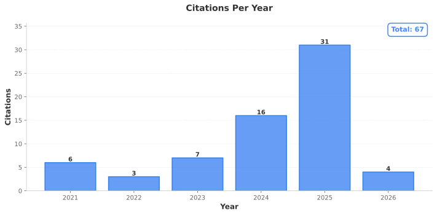

# Ziyuan Huang, PhD

**Postdoctoral Associate** | UMass Chan Medical School
PhD in Data Sciences | Greater Boston

## About Me

I apply artificial intelligence and deep learning to advance understanding of Alzheimer's disease and complex heterogeneous conditions. My research integrates multimodal data, such as microbiome profiles, blood biomarkers, immune measures, metabolomics, clinical records, and scientific literature, using statistical learning, machine learning, and large language models. I develop frameworks that combine computational approaches with biological insights to improve disease understanding and inform future therapeutic strategies for neurodegenerative diseases.

## Research Program

### ADAM (Alzheimer's Disease Analysis Model)

**ADAM-1** (published IEEE Access, 2025): Multi-agent reasoning framework combining large language models with ensemble classifiers for AD classification, integrating microbiome and clinical data with explainable AI.

**ADAM-2** (in development): Expanding to oral/gut microbiomes, peripheral biomarkers, immune profiles, metabolomics, and neuroimaging within the ATN (Amyloid/Tau/Neurodegeneration) framework. Fine-tuning domain-specific language models using LoRA/QLoRA with retrieval-augmented generation.

**Performance Standards**: Reproducible classification (AUC ≥0.80, F1 ≥0.70) with SHAP-based interpretability and literature concordance ≥80%.

### Key Research Areas

- Oral-gut microbial axis in cognitive decline and systemic inflammation
- Multimodal data integration for AD biomarker discovery
- Explainable AI with biologically interpretable, literature-grounded insights
- Systems-level modeling of microbiome-immune-brain interactions

## Technical Expertise

- **AI/ML**: Large language models (fine-tuning, RAG), ensemble methods (Random Forest, XGBoost, LightGBM), graph neural networks, explainable AI (SHAP)
- **Computational Biology**: Metagenomic sequencing analysis, multi-omics integration, systems modeling, differential abundance methods
- **Infrastructure**: GPU-accelerated workstations, HPC clusters, containerization, version control, reproducible workflows
- **Tools**: Python, R, PyTorch, Hugging Face Transformers, QIIME2, MetaPhlAn, scikit-learn

## Publications & Impact

Contributing to federally-funded projects developing computational platforms for multimodal biomedical data analysis. Published peer-reviewed research on AI disease classification, microbiome analysis, and graph neural networks. Collaborating across clinical departments to analyze longitudinal patient data from large cohorts (GAINS: 260+ participants).

Recent publications include:

- ADAM-1 framework (IEEE Access, 2025)
- Oral-gut microbiome axis in AD (AAIC 2025)
- Multimodal graph neural networks for AD research
- Genetic networks and urinary microbiome studies

See [My_Publications/](My_Publications/) for full list.

## Collaboration Interests

I'm interested in collaborations involving:

- Multimodal AI for biomedical applications
- Microbiome-brain axis research
- Explainable AI in clinical settings
- Deep learning for neurodegenerative diseases
- Open-source platforms for data harmonization and interpretable analysis

## Academic Profile & Impact

[](https://scholar.google.com/citations?user=WgqFSKUAAAAJ&hl)

[](https://scholar.google.com/citations?user=WgqFSKUAAAAJ&hl)
[](https://scholar.google.com/citations?user=WgqFSKUAAAAJ&hl)
[](https://scholar.google.com/citations?user=WgqFSKUAAAAJ&hl)



> Metrics updated weekly via automated workflow. Visit [Google Scholar](https://scholar.google.com/citations?user=WgqFSKUAAAAJ&hl) for real-time data.

📫 **Contact**: melhzy@gmail.com

---

## Citations & References

To cite my work, copy and paste the appropriate BibTeX entry below:

### 2025 Publications

**ADAM-1: AI Reasoning Model for Alzheimer's Disease Detection**

```bibtex
@article{huang2025adam1,
  title={ADAM-1: An AI Reasoning and Bioinformatics Model for Alzheimer's Disease Detection and Microbiome-Clinical Data Integration},
  author={Huang, Ziyuan and Sekhon, Vishaldeep Kaur and Sadeghian, Roozbeh and Vaida, Maria L. and Jo, Cynthia and McCormick, Beth A. and Ward, Doyle V. and Bucci, Vanni and Haran, John P.},
  journal={IEEE Access},
  volume={13},
  pages={145953--145967},
  year={2025},
  month={August},
  publisher={IEEE},
  doi={10.1109/ACCESS.2025.3599857},
  pmid={41036149},
  pmcid={PMC12483529}
}
```

**Multimodal Graph Neural Networks in Healthcare**

```bibtex
@article{vaida2025multimodal,
  title={Multimodal Graph Neural Networks in Healthcare: A Review of Fusion Strategies Across Biomedical Domains},
  author={Vaida, Maria and Huang, Ziyuan},
  journal={Frontiers in Artificial Intelligence},
  volume={8},
  pages={1716706},
  year={2025},
  month={January},
  publisher={Frontiers Media SA},
  doi={10.3389/frai.2025.1716706}
}
```

**Oral-Gut Microbiome in Alzheimer's Disease (AAIC 2025)**

```bibtex
@inproceedings{huang2025aaic,
  title={Utilizing Latent Dirichlet Allocation and Differential Abundance to Identify Microbial Communities in both the Oral and Fecal Microbiome Associated with Alzheimer's Disease},
  author={Huang, Ziyuan and Zeamer, Abigail L. and Ward, Doyle and Jo, Cynthia and Bucci, Vanni and Haran, John P.},
  booktitle={Alzheimer's Association International Conference (AAIC)},
  year={2025},
  doi={10.1002/alz.089296}
}
```

**ASD-Cancer Framework Commentary**

```bibtex
@article{huang2025asd,
  title={Decoding Cancer Prognosis with Deep Learning: The ASD-Cancer Framework for Tumor Microenvironment Analysis},
  author={Huang, Ziyuan and Li, Yunzhan and Bucci, Vanni and Haran, John P.},
  journal={mSystems},
  volume={10},
  number={5},
  year={2025},
  doi={10.1128/msystems.01455-24}
}
```

**Urinary Microbiome in UTI**

```bibtex
@article{bradley2025urinary,
  title={The Urinary Microbiome Distinguishes Symptomatic Urinary Tract Infection from Asymptomatic Older Adult Patients Presenting to the Emergency Department},
  author={Bradley, Evan S. and Stansky, Celina and Zeamer, Abigail L. and Huang, Ziyuan and Cincotta, Lindsey and Lopes, Abigail and Potter, Linda and Fontes, Theresa and Ward, Doyle V. and Bucci, Vanni and McCormick, Beth A. and Haran, John P.},
  journal={Virulence},
  volume={16},
  number={1},
  pages={2546063},
  year={2025},
  doi={10.1080/21505594.2025.2546063}
}
```

**Genetic Networks in Woody Plants**

```bibtex
@article{lu2025genetic,
  title={Unveiling the Genetic Networks: Exploring the Dynamic Interaction of Photosynthetic Phenotypes in Woody Plants Across Varied Light Gradients},
  author={Lu, Kaiyan and Zhou, Ziyang and Huang, Ziyuan and Bu, Chenhao and Gong, Huiying and Jiang, Libo and Zhang, Deqiang and Fang, Qing and Zhang, Xiao-Yu and Song, Yuepeng},
  journal={Plant Physiology and Biochemistry},
  volume={221},
  pages={109616},
  year={2025},
  doi={10.1016/j.plaphy.2025.109616}
}
```

### 2023 Publication

**English Language Proficiency in Transnational Education**

```bibtex
@article{wang2023english,
  title={English Language Proficiency, Prior Knowledge, and Student Success in an International Chinese Accounting Program},
  author={Wang, Hui and Schultz, Jennifer Lynn and Huang, Ziyuan},
  journal={Heliyon},
  volume={9},
  pages={e18596},
  year={2023},
  doi={10.1016/j.heliyon.2023.e18596}
}
```

### 2020 Publication

**Machine Learning for Photosynthetic Rate Prediction**

```bibtex
@article{zhang2020machine,
  title={Machine Learning Models for Net Photosynthetic Rate Prediction Using Poplar Leaf Phenotype Data},
  author={Zhang, Kai-Bo and Huang, Ziyuan and Sun, Shuai and Liu, Andrew and Song, Yuepeng and Zhang, Deqiang and Yang, Xing and Wang, Huiying},
  journal={PLoS ONE},
  year={2020},
  doi={10.1371/journal.pone.0228645}
}
```

---

*This repository contains grant applications, publications, and computational tools from my Alzheimer's disease research program at UMass Chan Medical School.*
